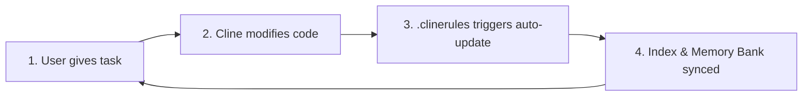

# Arbok MCP Server

AST-based code analysis MCP server that reduces token consumption by providing lightweight code structure queries instead of reading entire files.

## Why Arbok?

Cline is powerful but expensive — it reads entire source files to understand your codebase, consuming thousands of tokens per exploration. Arbok solves this by:

1. **AST Index**: Instead of reading 500-line files, Cline gets a 20-line summary of functions/classes/signatures
2. **Memory Bank**: Project context is pre-generated so Cline doesn't need to re-explore on every task  
3. **Auto-setup**: .clinerules are generated automatically to teach Cline to use Arbok
4. **Real-time sync**: File watcher keeps everything up-to-date as you code

## Features

- **AST Parsing**: Uses tree-sitter to parse TypeScript, JavaScript, and Python files
- **Symbol Indexing**: Extracts and indexes functions, classes, interfaces, methods, and more
- **Dependency Tracking**: Resolves imports, extends, and implements relationships
- **Real-time Updates**: File system watcher keeps the index up-to-date
- **Memory Bank**: Generates Cline-compliant documentation files summarizing project structure
- **Cline Integration**: Auto-generates .clinerules for optimal workflow

## Quick Start with Cline

1. Add Arbok as an MCP server in Cline settings
2. In Cline chat, use: `arbok:init` with your project path
3. Arbok will (Plan Mode first, then Act Mode):
   - Scan your project and create an AST index (.arbok/index.db)
   - Generate Memory Bank files (memory-bank/)
   - Create .clinerules for optimal Cline integration
4. Start coding with dramatically reduced token consumption!

## Automated Workflow & Best Practices

### Zero-Touch Documentation

You **do not need to manually run** `arbok:update_memory_bank` or `arbok:update_index` during normal development. Arbok is designed to work with **Cline Rules (`.clinerules`)**, which automate the entire update cycle for you.

### How It Works

When `.clinerules` are in place, the update flow is fully automatic:

1. **You** give a coding task to Cline.
2. **Cline** modifies the code to complete the task.
3. **Cline** (triggered by `.clinerules`) **automatically runs** `arbok:update_index` and `arbok:update_memory_bank` to sync the index and documentation with the latest code state.



### When to Run Manually

You only need to run `arbok:update_index` or `arbok:update_memory_bank` manually if you have made changes to the codebase **outside of Cline** (e.g., manual edits in VS Code, `git pull`, branch switching, etc.).

## Requirements

- Node.js >= 22.0.0

## Installation

```bash
npm install
npm run build
npm run build:wasm  # Build tree-sitter WASM grammars
```

## Usage

### Development

```bash
npm run dev
```

### Production

```bash
npm start
```

### Docker

```bash
docker-compose up
```

## MCP Tools

### Init Tool（統合初期化ツール）

#### `arbok:init`

Unified project initialization. Sets up the project index (`.arbok/`), Memory Bank (`memory-bank/`), and Cline rules (`.clinerules/`) in one go. Smart and idempotent: only creates what is missing, skips what already exists.

**Plan Mode** (default): Performs a discovery scan and reports what will be created.  
**Act Mode** (`execute: true`): Creates missing resources.

```json
{
  "projectPath": "/workspace",  // required - absolute path to the project
  "execute": true               // optional - set to true in Act Mode
}
```

### Get Tools（情報取得用）

#### `arbok:get_file_structure`

Get the structure of a specific file. Returns symbols (functions, classes, etc.) with their metadata but WITHOUT source code.

```json
{
  "filePath": "src/index.ts"  // required - relative path from project root
}
```

#### `arbok:get_symbols`

List symbols matching a name across the entire project. Supports partial matching.

```json
{
  "query": "hello",           // required
  "kind": "function"          // optional: function, class, variable, interface, method, type_alias, enum
}
```

#### `arbok:get_dependencies`

Get dependency relationships for a file or symbol. Returns imports, calls, extends, and implements relationships.

```json
{
  "filePath": "src/index.ts",  // optional
  "symbolName": "hello"        // optional
}
```

### Update Tools（更新用）

#### `arbok:update_index`

Re-index the project. Scans all source files, parses them with Tree-sitter, extracts nodes and edges. If the index already exists, it is refreshed.

**Plan Mode** (default): Dry run / preview.  
**Act Mode** (`execute: true`): Performs actual re-indexing.

```json
{
  "projectPath": "/workspace",  // required - absolute path to the project
  "execute": true               // optional - set to true in Act Mode
}
```

#### `arbok:update_memory_bank`

Update Memory Bank files with current project structure, components, and dependencies. If the memory-bank directory and basic files do not exist, they are created and initialized. If they already exist, they are updated with the current project state.

**Plan Mode** (default): Dry run / preview.  
**Act Mode** (`execute: true`): Performs actual update.

```json
{
  "projectPath": "/workspace",      // required - absolute path to the project
  "memoryBankPath": "memory-bank",  // optional - defaults to memory-bank/
  "execute": true                   // optional - set to true in Act Mode
}
```

Generates 6 Cline-compliant Memory Bank files:
- `productContext.md` — Project purpose and user experience goals
- `activeContext.md` — Current work focus and recent changes
- `progress.md` — What works, what's left, known issues
- `systemPatterns.md` — Architecture and design patterns
- `techContext.md` — Technologies, dependencies, and setup
- `project-structure.md` — File tree and symbol index

#### `arbok:update_rules`

Update .clinerules configuration files for Cline integration. If .clinerules or related config files do not exist, they are generated from scratch. If they already exist, they are updated with necessary changes.

**Plan Mode** (default): Dry run / preview.  
**Act Mode** (`execute: true`): Performs actual update.

```json
{
  "projectPath": "/workspace",  // required - absolute path to the project
  "execute": true               // optional - set to true in Act Mode
}
```

Creates:
- `.clinerules/rules.md` — Base rules for efficient file access
- `.clinerules/workflows/update_memory.md` — Memory Bank update workflow

## Configuration

Set environment variables in `.env`:

```env
PROJECT_PATH=/workspace  # Path to your project
DEBUG_SQL=false          # Enable SQL query logging
```

## Database

The server uses SQLite to store indexed symbols and relationships. The database is stored in `.arbok/index.db` within your project directory.

## Architecture

- **`src/config.ts`**: Configuration management
- **`src/types/`**: TypeScript type definitions
- **`src/database/`**: SQLite connection and queries
- **`src/core/`**: AST parsing and node/edge extraction
- **`src/watcher/`**: File system watcher
- **`src/mcp/`**: MCP server and tool implementations

## Supported Languages

**Fully Supported (with AST parsing):**
- TypeScript (`.ts`, `.tsx`)
- JavaScript (`.js`, `.jsx`)
- Python (`.py`)

**Scan Only (parser not yet implemented):**
- Go (`.go`)
- Rust (`.rs`)

## License

MIT
